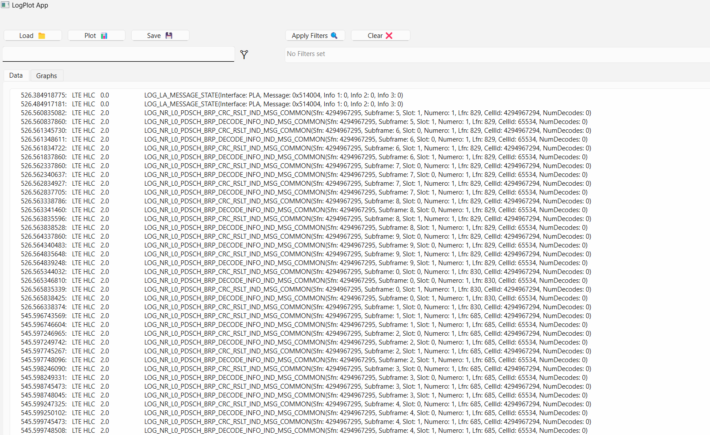

# LogPlot
LogPlotter is designed to streamline the process of parsing large-scale log files and visualizing the extracted data in a meaningful way. It provides an intuitive interface and powerful tools for real-time analysis, helping developers and system administrators to quickly identify and respond to system anomalies, performance bottlenecks, and security threats.

# Getting Started
This section provides guidance on setting up LogPlotter on your local environment for development, testing, and deployment purposes.

### Prerequisites
Before you begin, ensure you have the following installed on your machine:

Python 3.8 or higher
pip (Python package installer)


```bash
pip install -r requirements.txt
```

### Installing

A step by step series of examples that tell you how to get a development env running:

Step 1: Clone the repo

```bash
git clone https://github.com/VSARJUNA/LogPlot.git
cd [version_num]
```

Step 2: Install required packages

```bash
pip install -r requirements.txt
```

## Building the Executable

To build an executable using PyInstaller:

```bash
pyinstaller --onefile main.py
```

Replace `main.py` with the name of your Python script. Add more options to PyInstaller if necessary, depending on your project's requirements.

## Screenshots

 "Log plot"
